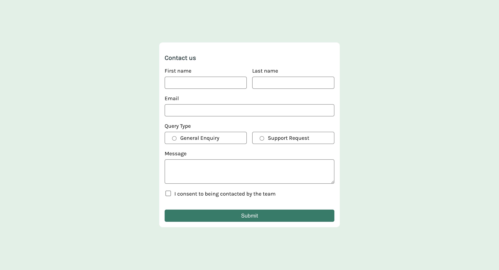
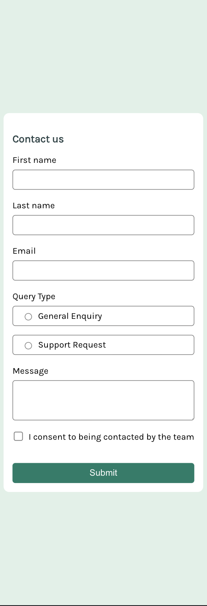

# Frontend Mentor - Contact form

This is a solution to the [Contact form challenge on Frontend Mentor](https://www.frontendmentor.io/challenges/contact-form--G-hYlqKJj). Frontend Mentor challenges help you improve your coding skills by building realistic projects. 

# The challenge

Users should be able to:

- Complete the form and see a success toast message upon successful submission
- Receive form validation messages if:
    - A required field has been missed
    - The email address is not formatted correctly
- Complete the form only using their keyboard
- Have inputs, error messages, and the success message announced on their screen reader
- View the optimal layout for the interface depending on their device's screen size
- See hover and focus states for all interactive elements on the page

## Screenshot

### Desktop Version

### Mobile Version

### Built with

- Semantic HTML5 markup
- CSS custom properties
- Flexbox

### What I learned

The `<meta name="viewport" content="width=device-width, initial-scale=1"/>` tag provided is used in HTML to control the layout on mobile browsers. 

I have also improved my understanding of absolute position with the notification popup.

``
.popup {
  position: absolute;
  top: 5%;
}
``

The aspect I'm most proud of is the flexbox. Through this project, I've significantly deepened my understanding of flexbox.